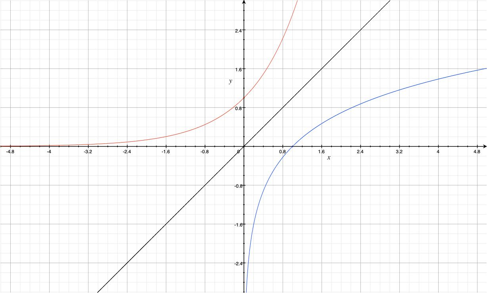

# Exponenten

## Definition

* $x^0 = 1$
* $x^{n+1} = x^n * x$
* $x^{n-1} = \frac{x^n}{x}$
* wenn $x=0$ ist $x^n$ nur für ein **positives** $n$ definiert!

Eine Exponentialfunktion ist eine Funktion in der Form: $f(x) = a*b^x$

$a$ ist die Verschiebung der Kurve auf der x-Achse. $b$ ist die Steilheit der Kurve.

* Ordnet reele Zahlen positiven reelen Zahlen zu. ($\mathbb{R} \rightarrow \mathbb{R}_{+}$)
* Es muss $b > 0$ gelten, da die Funktion ansonsten Teilweise undefiniert ist.
* Es muss $b \neq 1$ gelten, da es ansonsten eine lineare Funktion wird.
* Wenn $b > 1$, ist die Kurve monoton steigend (Exponentielles Wachstum)
* Wenn $b < 1$, ist die Kurve monoton fallend (Exponentieller Zerfall)
* Wenn $a = 1$, verläuft die Funktion durch den Punkt $(0, 1)$

## Gesetze

* $x^a * x^b = x^{a+b}$
* $x^a / x^b = x^{a-b}$
* $(x^a)^b=x^{a*b}$
\
* $a^x*b^x = (a*b)^x$
* $a^x/b^x = (a/b)^x$

## Euler'sche Zahl $e$

$e$ ist die euler'sche Zahl. Sie ist das Ergebnis, wenn man sich 100% Zins kontinuirlich auszahlen lässt.  
1.- wird nach einer 100% Periode zu $e$.-

Es ist die Definition **der Exponentialfunktion** $exp(x) = e^x$.

\newpage

## Gleichungen

Bei Gleichungen zu exponentieren ist eine Äquivalenzumformung.

Um eine Exponenzialfunktion herauszufinden, muss man 2 Punkte kennen.
Diese kann man dann einsetzten und das Gleichungssystem lösen.
So kann man zu der Funktion gelangen.

\
Folgende Probleme können gelöst werden:

**Beispiel 1** (Merken):  
Zeitschritt $= 10$; Faktor $= 5$;  
Punkt $= (3, 7)$;  
Punkt 2 = $= (16, x)$;

$x = 7*5^{\frac{16-3}{10}}$

Beispiel 2 (Herleiten):  
Zeitschritt $= 10$; Faktor $= 5$;  
Punkt $= (3, 7)$;  
Punkt 2 = $= (x, 8)$;

$x = 10*log_5(\frac{8}{7}) + 3$ (Umformung)

\
Beispiel 3 (Herleiten):  
Zeitschritt $= 10$; Faktor $= x$;  
Punkt $= (3, 7)$;  
Punkt 2 = $= (16, 8)$;

$x = (\frac{8}{7})^{\frac{10}{16-3}}$ (Umformung)

\
Beispiel 4 (Herleiten):  
Zeitschritt $= x$; Faktor $= 5$;  
Punkt $= (3, 7)$;  
Punkt 2 = $= (16, 8)$;

$x = \frac{16-3}{log_5(\frac{8}{7})}$ (Umformung)

\newpage

# Logarithmen

## Definition

$y = b^x \Leftrightarrow x = log_b(y)$  
$y = e^x \Leftrightarrow x = ln(y)$ (Natürlicher Logarithmus)

* Ordnet positive reele Zahlen reelen Zahlen zu. ($\mathbb{R}_{+} \rightarrow \mathbb{R}$)
* es muss $b > 0$ gelten, da Logarithmen durch Exponenten definiert sind.
* es muss $b \neq 1$ gelten, ...
* es muss $y > 0$ gelten, da $\mathbb{R}_{+} \rightarrow \mathbb{R}$.

Der Graph $y = ln(x)$ ist der Graph $y = exp(x)$ an $y=x$ gespiegelt.

{width=50%}

## Gesetze

* $log(x*y) = log(x) + log(y)$
* $log(x/y) = log(x) - log(y)$
* $log(x^r) = r*log(x)$
\
* $log_b(x) = \frac{ln(x)}{ln(b)} = \frac{log_c(x)}{log_c(b)}$

## Gleichungen

Wenn bei Gleichungen der Logarithmus ($log_b(x)$) verwendet wird, muss darauf geachtet werden,
dass $b>0$ und $x>0$ gilt.
