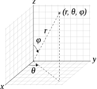
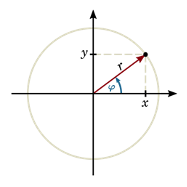
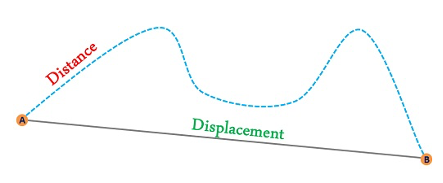

---
header-includes:
   - \usepackage{pgfplots}
---

# Describing Motion

## Position:

Cartesian coordinates (X, Y, Z)

{width="0.7628860454943132in"
height="0.7628860454943132in"}

Spherical coordinates (radius, angle, angle)

{width="1.3195877077865268in"
height="1.2206189851268592in"}

Polar coordinates (radius, angle)

{width="1.2371128608923885in"
height="1.2371128608923885in"}

Displacement-Time graph:  
Plots the displacement over time.

\newpage

# Velocity and Speed:

{width="2.9484536307961506in"
height="1.2230621172353455in"}

$Avg. speed = distance / time$  
$Avg. velocity = displacement / time$

Velocity-Time graph:  
Plots the Velocity over time.

(Area under the graph gives the displacement)  
(Don't draw vertical lines!!)

# Acceleration:

$Acceleration = changeInVelocity / time$

Acceleration-Time graph:  
Plots acceleration over time.

(we only use uniform acceleration with a constant a.)

# Graphs:

\begin{tikzpicture}
\begin{axis}[
    title={Different Graphs},
    xlabel={Time $[s]$},
    ylabel={S $[m]$ / V $[m/s]$ / a $[m/s^2]$},
    xmin=0, xmax=5,
    ymin=0, ymax=14,
    xtick={0,1,2,3,4,5},
    ytick={0,2,4,6,8,10, 12, 14},
    legend pos=north west,
    ymajorgrids=true,
    grid style=dashed,
]

\addplot[
    color=blue,
    mark=square,
    ]
    coordinates {
    (0,0)(1, 0.5)(2,2)(3,4.5)(4,8)(5,12.5)
    };
    \addlegendentry{S}
    
\addplot[
    color=green,
    mark=square,
    ]
    coordinates {
    (0,0)(1, 1)(2,2)(3,3)(4,4)(5,5)
    };
    \addlegendentry{V}

\addplot[
    color=red,
    mark=square,
    ]
    coordinates {
    (0,1)(1, 1)(2,1)(3,1)(4,1)(5,1)
    };
    \addlegendentry{a}
    
\end{axis}
\end{tikzpicture}

\newpage

# Free Fall:

Free fall means no resistance. All object will fall at the same speed.  
It works with uniform acceleration: $g \approx 10 m/s^2$.

# Formulary

**Symbols:**

Symbol for time: t  
Unit: $[t] = 1 s$

Symbol for displacement: S  
Unit: $[S] = 1 m$

Symbol for speed: V  
Unit: $[V] = 1 m/s$

Symbol for Acceleration: a  
Unit: $[a] = 1 m/s^2$

**Formulas:**

* $Avg. speed = distance / time$

* $Avg. velocity = displacement / time$

* $Acceleration = changeInVelocity / time$

* $S(t) = V * t$ (without acceleration)

* $S(t) = a/2 * t^2$ (with acceleration)

* $S(t) = V0 * t + a/2 * t^2$ (with initial speed)

* $V(t) = a * t$ (if there is a initial speed it has to be added: $V(t) = V0 + a * t$)

* $1 m/s = 3.6 km/h$

* $g = 9.81 m/s^2 \approx 10 m/s^2$

Formulas for constant acceleration:

  Given   Unknown   Formula 1                       Formula 2
  ------- --------- ------------------------------- ---------------------
  a, t     v, s      $v = a*t$                        $s = a/2 * t^2$
  a, v    t, s      $t = v/a$                         $s = v^2/2a$
  a, s    v, t      $v = \sqrt{2as}$                   $t = \sqrt{2s/a}$
  v, s    a, t      $a = v^2 / 2s$                   $t = 2s / v$
  v, t    a, s      $a = v/t$                         $s = v*t / 2$
  t, s    v, a      $v = 2s / t$ (only with $a > 0$)   $a = 2s / t^2$
