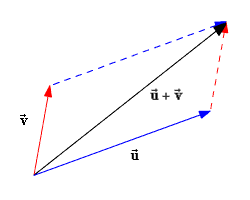

# Mechanics

For mechanics, please check the following file: [Summary Mechanics](/PhysicsSummary21-10-2020.pdf)

# Dynamics

## Newton's First Law Of Motion

If there is no force acting on an object:

* If it is at rest, it stays at rest.
* If it is moving, it keeps on mocing at constant Velocity

$\rightarrow$ No force means no acceleration

\
This law tells us, that objects don't want to change the state of their motion.
That is called **inertia**.

Inertia depends on the Mass of the object.

## Newton's Second Law Of Motion

Equation of Motion:

$F = m*a$

with:

* m: Mass that is accelerated
* a: acceleration
* F: the magnitude of the sum of all acting Forces

\
We use following Units:

* $[F]: 1N$ (Newton)
* $[m]: 1kg$ (kilogram)
* $[a]: 1m/s^2$ (metres per second squared)

\newpage

## Forces

Forces can:

* accelerate an object.
* deform an object.

\
To define a Force we need:

* the magnitude
* the direction
* the point of attack

To get all of that information, we use vectors.  
A vector $\vec{u} = \begin{pmatrix} a \\ b \end{pmatrix}$ moves
the point $A = \begin{pmatrix} x, y \end{pmatrix}$ to 
the point $A' = \begin{pmatrix} x+a, y+b \end{pmatrix}$

The magnitude of a vector $\vec{a}: |\vec{a}| = a$

when we use a Symbol for the vector, we use an arrow $\vec{}$ .
If we want to draw the vector, it also is a arrow, pointing in the direction
of the force. The leght of the arrow represents its magnitude.

To sum up multiple vectors, we must draw them, all starting at the
end of the arrow before. The vector from the start of the first vector to
the end of the last arrow is the sum of all of them.

{width=40%}

These other Operations exist:

* $\vec{a} + \vec{a} = 2*\vec{a}$
* $\vec{a} - \vec{a} = \vec{0}$
* $\vec{a} - \vec{b} = \vec{a} + (-\vec{b})$

\
If multiple forces are acting on one Object, we call the sum of these
the resultant force. Like that we can simplify the acting forces.

\newpage

# Newton's Third Law Of Motion

If there is a Force $\vec{F_A}$ acting on object B,
there will be a Force $\vec{F_B}$ acting on object A.  
These two Forces act in opposite directions:
$$\vec{F}_A = -\vec{F}_B$$

*Example:*  
Sitting on a cart and throwing a rock:  
The rock will fly away, your cart will be pushed in opposite direction.

# Weight and Normal Force

Weight is a **force**, which depends on an Objects Mass,
aswell as the acceleration of gravity. ($g \approx 10m/s^2$ on earth)

The weight of an object is calculated with: $\vec{F}_W = m*g$

The weight force $\vec{F}_W$ points to the center of Earth and
attacks at the center of mass of an Object.

\
Normal Force is a force, which acts, if two objects are in contact.
It acts percundicular to the contact-area. If the contact area is horizontal,
the magnitude of the normal force equals the magnitude of the
weight force of the object.

# Hooke's Law

Forces deform objects. An object can be deformed plasticly or elasticly.

* Plastic means, that if there is no force acting anymore, it won't go back to its original form.
    * Dough
* Elastic means that if there is no force acting anymore, it goes back to its original form.
    * Spring (if not deformed too much)

\
A spring (which deforms elasticly) deforms linearly proportional to the applied force.
The spring constant $D$ tells us, how stiff the spring is. 
**The bigger $D$, the stiffer ist the spring.**

$$F_D = D * s$$

Because of it's linear deformation, a spring can be used as
a measurement device for forces.
